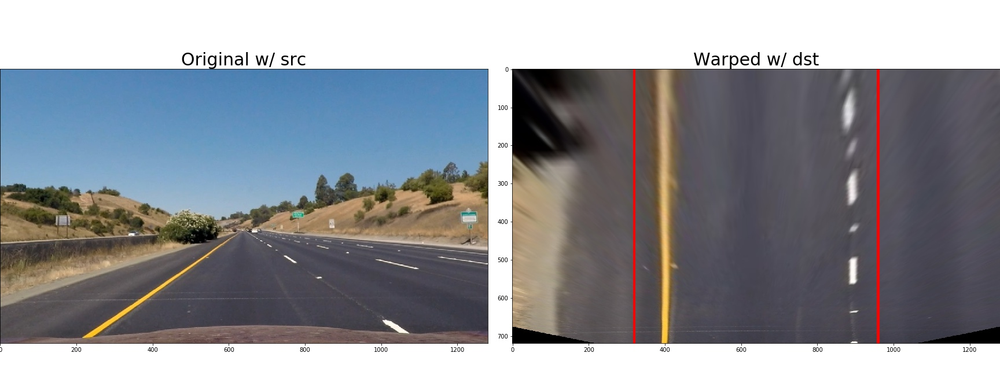
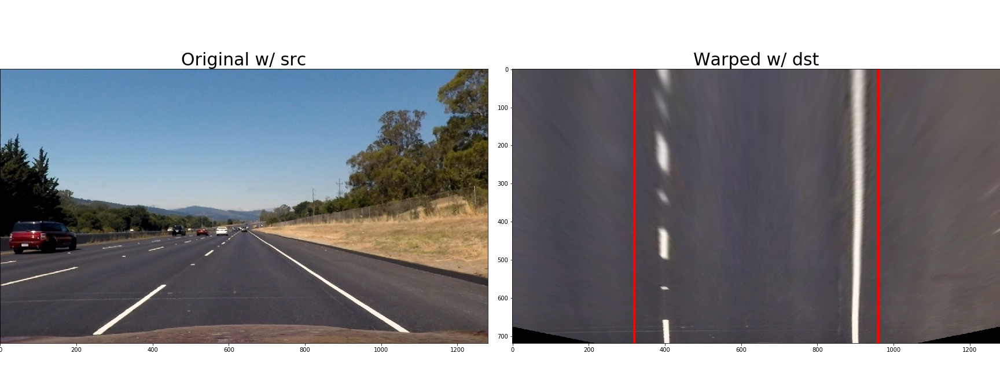
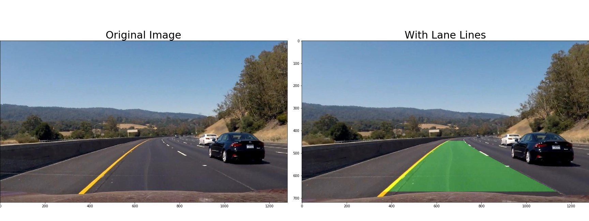
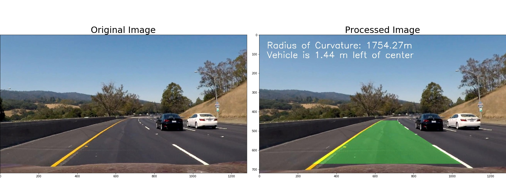

## Thomas J. Chmielenski

##### P4 - Advanced Lane Finding Project
##### September 25, 2017

---
**Goals**

The goals / steps of this project are the following:

* Compute the camera calibration matrix and distortion coefficients given a set of chessboard images.
* Apply a distortion correction to raw images.
* Use color transforms, gradients, etc., to create a thresholded binary image.
* Apply a perspective transform to rectify binary image ("birds-eye view").
* Detect lane pixels and fit to find the lane boundary.
* Determine the curvature of the lane and vehicle position with respect to center.
* Warp the detected lane boundaries back onto the original image.
* Output visual display of the lane boundaries and numerical estimation of lane curvature and vehicle position.

[//]: # (Image References)


[image4]: ./output_images/thresholdedx-derivative.png "Thresholded X-derivative"
[image5]: ./output_images/thresholdedy-derivative.png "Thresholded Y-derivative"
[image6]: ./output_images/thresholded_magnitude.png "Thresholded Magnitude"
[image7]: ./output_images/thresholded_direction.png "Thresholded Direction"
[image8]: ./output_images/combined_thresholds.png "Combined Thresholds"


color_binary.png
combined_thresholds.png
thresholdedx-derivative.png
thresholdedy-derivative.png
thresholded_direction.png
thresholded_magnitude.png
thresholds.png

[image116]: ./output_images/thresholds.png "Gradient Thresholds"
[image117]: ./output_images/orig_vs_combinedThresholds.png "Threshold binary Image"


[video1]: ./project_video.mp4 "Video"

---

## [Rubric](https://review.udacity.com/#!/rubrics/571/view) Points

### Here I will consider the rubric points individually and describe how I addressed each point in my implementation.  

---

#### 1. Provide a Writeup / README that includes all the rubric points and how you addressed each one.  You can submit your writeup as markdown or pdf.  [Here](https://github.com/udacity/CarND-Advanced-Lane-Lines/blob/master/writeup_template.md) is a template writeup for this project you can use as a guide and a starting point.  

You're reading it!  Code for this project discussed here can be found in the IPython notebook located here: `./P4-Advanced-Lane-Lines-Final.ipynb`


~~~

### Code Block #3 - Region of Interest
x_factor = 40
    y_factor = 60
    vertices = np.array([[
        (0,image.shape[0]),
        (((image.shape[1]/2)- x_factor), (image.shape[0]/2)+ y_factor), 
         (((image.shape[1]/2) + x_factor), (image.shape[0]/2)+ y_factor), 
         (image.shape[1],image.shape[0])]], dtype=np.int32)

### Code Block #4 - Default Threshold functions

### Code Block #5 - Experimenting Combining of color and gradient thresholds

~~~


### Camera Calibration

#### 1. Briefly state how you computed the camera matrix and distortion coefficients. Provide an example of a distortion corrected calibration image.

The code for this step is located in the `./P4-Advanced-Lane-Lines-Final.ipynb`, under
`Computer the camera calibration matrix and distortion coefficients`

The function `compute_camera_calibration_coefficents` starts with `objpoints` array to store  the (x, y, z) coordinates of the chessboard 
corners in the real world. Here I am assuming the chessboard is fixed on the (x, y) plane at z = 0, 
such that the object points are the same for each calibration image.  Thus, `objp` is just 
a replicated array of coordinates, and `objpoints` will be appended with a copy of it every 
time I successfully detect all chessboard corners in a test image.  `imgpoints` will be appended with the (x, y) 
pixel position of each of the corners in the image plane with each successful chessboard detection.  

OpenCV gives us the `cv2.findChessboardCorners` function to  to easily find the corners in an image.  A corner is
defined as where the black and white corners meet. Coordinate 0,0 is at the top left.  Using the `cv2.drawChessboardCorners` method,
we can visualize this.  Here is an example:


Once I looped thru all 20 of the camera calibration images in the `./camera_cal/` directory., I called the openCV function: `cv2.calibrateCamera` to 
return the distortion coefficients and the camera matrix that we will need to transform 3D object points
to 2D image points.  This function also returns the rotation and translations vectors for the position of
the camera in the world.

Since we have the camera matrix and distortion coefficients, we can call the `cv2.undistort` function with a distorted 
images to return us back an undistorted version of this image, also known as destination iamge.

Here is an example of the original chessboard image as well as the undistorted version:


### Pipeline (single images)

#### 1. Provide an example of a distortion-corrected image.

To demonstrate this step, I will describe how I apply the distortion correction to one of the test images like this one:


The code for this step is located in the `./P4-Advanced-Lane-Lines-Final.ipynb`, under
`Apply a distortion correction to raw images.`


#### 2. Describe how (and identify where in your code) you used color transforms, gradients or other methods to create a thresholded binary image.  Provide an example of a binary image result.

The code for this step is located in the `./P4-Advanced-Lane-Lines-Final.ipynb`, under
`Use color transforms, gradients, etc., to create a thresholded binary image.`  Additional 
experimental  methods can be found in 'Appendix B:Appendix B:  More Threshold Exploration`.

I began by exploring the different color and gradient thresholds to generate a binary image trying to determine the 
optimum combinations to identify the lane lanes in the test images.  Let's walk thru the individual thresholds.


###### *Thresholded X-derivative*
The `abs_sobel_thresh` function with `orient='x'` takes an image and converts it to grayscale,
It then passes this grayscale image to `cv2.Sobel` function to calculate the derivative in the 'x' direction.
This method then returns a copy of the thresholded derivative image.

The Sobel operator is at the heart of the Canny edge detection algorithm.  Applying the Sobel operator to an 
image is a way of taking the derivative of the image in the x or y direction. 

Here is an example image of Thresholded X-derivative:
![Thresholded X-derivative][image4]

###### *Thresholded Y-derivative*
The `abs_sobel_thresh` function with `orient='y'` is the same function above, except that it calculates
the derivative in the 'y' direciton.

Here is an example image of Thresholded Y-derivative:
!["Thresholded Y-derivative"][image5]

###### *Magnitude of the Gradient*
The `mag_thresh` method takes an image and converts it to grayscale,
It then passes this grayscale image to `cv2.Sobel` function to calculate both the 'x' and 'y' derivatives.
It taking the square root of the sum of each of these derivatives squared, and then 
returns a copy of the thresholded magnitude image.

Here is an example imageof Thresholded Magnitude:
!["Thresholded Magnitude"][image6]

###### *Direction of the Gradient*
The `dir_threshold` method is similar to the `mag_thresh` function, but uses `arctan(sobely​​ /sobel​x)`
to determine the direction of the edges. Use a Kernel size of 15, and setting the threshold be 0.7 and 1.3 
seems reasonable to show vertical lane lines.  However it is much noiser than the gradient magnitude.

Here is an example image of Thresholded Direction:
!["Thresholded Direction"][image7]

###### *Combined Thresholds*
Then we can get crazy and experiment with these thresholds to figure out what is the optimal combination
to determine the lane lines.  Here is an example from the lession.

!["Combined Thresholds"][image8]

###### *My Exploration and Frustrations*

I spent most of my time here trying to explore and find the bet

```python
    LUV = cv2.cvtColor(image, cv2.COLOR_RGB2LUV)
    L = LUV[:,:,0]
    
    l_thresh = (170,255)
    l_binary = np.zeros_like(L)
    l_binary[(L > l_thresh[0]) & (L <= l_thresh[1])] = 1

    hsv = cv2.cvtColor(image, cv2.COLOR_RGB2HSV)
    S = hsv[:,:,1]
    
    s_thresh = (125, 255)
    s_binary = np.zeros_like(S)
    s_binary[(S > s_thresh[0]) & (S <= s_thresh[1])] = 1
    
    color_binary = np.zeros_like(S)
    color_binary[((s_binary == 1) | (l_binary == 1))] = 1


# This seciton NEEDS WORK - More explanation!

After a series of experiements, I came up with the following combined threshold:

```python
    ksize = 5 # Choose a larger odd number to smooth gradient measurements
    
    # Apply each of the thresholding functions
    gradx = abs_sobel_thresh(image, orient='x', sobel_kernel=ksize, thresh=(20, 100))
    grady = abs_sobel_thresh(image, orient='y', sobel_kernel=ksize, thresh=(40, 100))
    mag_binary = mag_thresh(image, sobel_kernel=ksize, mag_thresh=(30, 100))
    dir_binary = dir_threshold(image, sobel_kernel=15, thresh=(0.7, 1.3))

    combined = np.zeros_like(dir_binary)
    combined[((gradx == 1) & (grady == 1)) | ((mag_binary == 1) & (dir_binary == 1))] = 1
```

 


#### 3. Describe how (and identify where in your code) you performed a perspective transform and provide an example of a transformed image.

The code for this step is located in the `./P4-Advanced-Lane-Lines-Final.ipynb`, under
`Apply a perspective transform to rectify binary image ("birds-eye view").`

The function `create_birds_eye` takes in a distortion-corrected image, and returns a birds-eye or top
draw view of the current image.  Ultimately, we will use this image to measure the curvature of the lane
lines.  It is much easier to see and predict the lane curvature from a top-down perspective.  

First, we create a trapezoid shape that approximates the perspective view of the actual driving lane,
using a series of image size percentages:

~~~
    bottom_width = .76       # percent of bottom trapizoid height
    middle_width = .08       # percent of middle trapizoid height
    height_percentage = .62  # percent of the trapezoid height
    bottom_trim = .935       # percent from top to bottom to avoid car hood
~~~


This resulted in the following source and destination points:

| Source        | Destination   | 
|:-------------:|:-------------:| 
| 588, 446      | 320, 0        | 
| 691, 446      | 960, 0        |
| 1126, 673     | 960, 720      |
| 153, 673      | 320 720       |


These four points will defined the `src` points.  


One assumption here is that the camera is located in the center of the vehicle.  Using percentages
we can assume that perspective view must be symmetrical around the 'y' axis.  Thus, in the above iamge,
the vehicle may be slightly off the center of the lane, and thus the distance between the left and 
right lanes to `src` points are not equal.

We will then map these known points to four on the warped
image, we call the destination, or `dst` points.  Once we have these two sets of points, we can then call
the builtin cv2 function, `cv2.getPerspectiveTransform (src, dst)`, to compute the persepective transform, `M`.

We can then warp the image using the persepective transform, `M` by calling `cv2.warpPerspective` and getting a 
warped image back to start detecting lane lines on. 

We can also compute the inverse perspective transform, and reverse the two args, like this`cv2.getPerspectiveTransform (src, dst)`.
The returned inversed tranform, `Minv` will be necessary to reverse the warped image lane lines back on the
original image.

Key takeaways from this task are to make sure that our transform is perspectively correct.  To validate our transform,
we transform image that we know have straight lane lines in them and validate that the two lane lines are parallel
in our perspective transform.  Here are two examples:



Here is an example of a perspective transform on a known curve.


#### 4. Describe how (and identify where in your code) you identified lane-line pixels and fit their positions with a polynomial?

The code for this step is located in the `./P4-Advanced-Lane-Lines-Final.ipynb`, under
`Detect lane pixels and fit to find the lane boundary.`

Before we begin to identify the lane-line pixels, we must first create a distortion-correction image, as above,
and then apply our above threshold gradients to this image to actually detect the pixels that make up the lane lines.
We also apply a region of interest mask, where we focus only the area where we expect the lane lanes to be, which avoids
the detect of other objects in the scene as false positives. 

There are two main functions here. The first, `initial_sliding_windows_polyfit`, takes in a binary warped image and
returns a 2nd order polynimal fit for the left and right lines, like this:


This method takes a histogram of the bottom half of the image, and summing the pixel values for each column. The
most prominent peaks are mostly like where you are line line pixels will be.  Starting from these peaks, we divide
the image into a number of horiztonal windows (in my case 8), and use these windows as starting positions to search for
lane lines as we go progress up the image. From here, we can then approximately the lane line using a 2nd order polynimal fit. 

The best way to explain what is happening is to watch Udacity's 
[https://youtu.be/siAMDK8C_x8](Finding Lane Pixels by Histogram and Sliding Window ) short animation on this topic!

The second method, `polyfit_using_previous_fit`, takes in a binary warped image, and the previous left and right fit lane line
and then we don't have to do start with a blind search for lane lines.  We just use a margin=100 and a minpix = 40 to 
slide the window around to see if the lane lane pixels shifted slightly.
This method also returns the right and left fitted lane lines.   Here is an example of this.


#### 5. Describe how (and identify where in your code) you calculated the radius of curvature of the lane and the position of the vehicle with respect to center.

The code for this step is located in the `./P4-Advanced-Lane-Lines-Final.ipynb`, under
`Determine the curvature of the lane and vehicle position with respect to center.`

The `radius_of_curvature` method takes in a binary_image, and left and right fitted lane lines, and converts
these lane lines in pixels to lanes lines in real world space in meters.  The problem statement stated
we can assume 30 meters per 720 pixels in the 'y' dimension and 3.7 meters per 700 pixels in the 'x' direction.
We then find new polynomials to x, y in world space.

[http://www.intmath.com/applications-differentiation/8-radius-curvature.php](http://example.com)

We can then calculate the curve radius for both the left and right lanes, and then average them together to get
the curve radius.  My curve radius fluctuated a lot, but this is mainly because I didn't have time to implement
a smoothing algorhitm to smooth our the curves.  This would give a better experience if the lane finding encountered
shadows, drastic differences in lighting conditions, etc.

To calculate the distance the vehicle, I assume that the camera is mounted in the center of the vehicle
and the find where the left and right fit polynomials intersect the bottom of the image, take the average
and subtract from the camera pos (center pixel of image).  Because our world space was in meters, this
distance from the center of lane will also be in meters.  This value too, fluctuated a lot, Implementing a
smoothing algorhitm could help here as well.

#### 6. Provide an example image of your result plotted back down onto the road such that the lane area is identified clearly.

The code for this step is located in the `./P4-Advanced-Lane-Lines-Final.ipynb`, under
`Warp the detected lane boundaries back onto the original image.`

The `warp_lane_boundaries_back` function takes as arguments: the original undistored image, the warped binary image, the inverse
transform (`Minv`), and well as the left and right fits.  Here are two examples of warping the lane boundaries back:



The `overlay_text_on_image` function take this newly unwarped image, the average curve radius, and the distance from 
center values calculated above and overlays these values on the image, like this:



---

### Pipeline (video)

#### 1. Provide a link to your final video output.  Your pipeline should perform reasonably well on the entire project video (wobbly lines are ok but no catastrophic failures that would cause the car to drive off the road!).

Here's a [link to my video result]([./project_video.mp4](http://example.com))

In my pipeline, I had to keep track of the last right and left fitted lane lines using global variables. Since I mostly finished with my project
workflow, I choose not to implement a `Line` class rather at this time.  If I had more time, as we all say, we would refactor the code
properly!

If either of the `initial_sliding_windows_polyfit`or `polyfit_using_previous_fit` functions did not successfully
return a good lane line fit, I had to revert back to the a previous good fit.

---

### Discussion

#### 1. Briefly discuss any problems / issues you faced in your implementation of this project.  Where will your pipeline likely fail?  What could you do to make it more robust?

This project was fun, challenging, frustrating and rewarding all in one.  Even those I was
 [severely frustrated with my thresholds](https://discussions.udacity.com/t/my-right-lane-line-extends-outside-the-lane/373500/22), and was ready
to throw in the towel many times, I saw it out.  Somewhere in my Jupyter notebook, there was an error that I just couldn't find. So until I rewrote
my thresholds code, I kept pulling my hair out until I decided to rewrite this section.  The section performed better but still wasn't much
easier.

Combining Color and Gradient Thresholds is tedious and time consuming.  Many times, a combination would work in one frame but not in another. 
I felt that I was rocking back in forth and never finding a solid solution.  I found a useful tool (`threshold.py`) on the web, (forget exactly
where) to help me visualize different color channel.  If I had more time, I would extend this tool to include other colorspaces as well as
gradient thresholds.

As for my pipeline, it is not very robust. My code barely recovers from the shadows and the concrete bridge areas.  Adding smoothing over
multiple lane fits would probably help. Thanks for the challenging project.  I learned more than I ever expected in this class.


### Links

• Advanced Lane Line Project1
https://chatbotslife.com/advanced-lane-line-project-7635ddca1960

• More robust lane finding using advanced computer vision techniques1
https://chatbotslife.com/robust-lane-finding-using-advanced-computer-vision-techniques-46875bb3c8aa

• Self-Driving Car Project Q&A | Advanced Lane Finding
https://www.youtube.com/watch?v=vWY8YUayf9Q&list=PLAwxTw4SYaPkz3HerxrHlu1Seq8ZA7-5P&index=4

Radius of Curvature
http://www.intmath.com/applications-differentiation/8-radius-curvature.php
